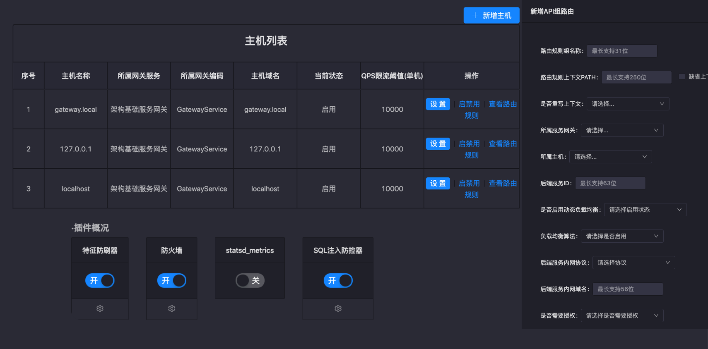

[![][ngr-logo]][ngr-url]

# NgRouter - A Pratical API Gateway

 

NgRouter是基于OpenResty开发的API网关，继承了Nginx的高并发、低延迟的强大性能的同时，也提供诸如认证鉴权、限流、熔断、健康检查、动态上游发现等常用功能。通过集群化横向扩展多实例的部署方式，可作为企业级边缘网关承载百万级并发，也可根据环境的逻辑划分，每个逻辑单元部署一套，用于需要多环境管理的场景。

NgRouter is an enterprise-class API gateway based on Openresty. Compared to Openresty, it has almostly the same performance of high concurrency and low latency, it also has a lot of common practical functions such as authentication of requests, dynamically upstream lists, health check, rate limiting, fault torlerance,  etc. NgRouter can be deployed in single -node mode (usually for experiment), and can be scaled to multi-cluster mode, each cluster is dedicated for a logical environment. This makes it very suitable for the cases of multi-environment.

更多关于NgRouter的详细介绍请参见[NgRouter Docs](https://github.com/gogo-easy/ngr/wiki)

## 管理页面截图

## Feature

- **统一管理界面**

  NgRouter提供了统一的管理页面集中管理不通的网关集群（cluster），不同网关集群配置隔离，同一网关集群内的网关实例共享本集群的配置

- **配置修改实时生效**

  在管理页面对集群配置修改后，实时推送该集群的所有网关实例，立即生效

- **支持插件管理**

  NgRouter的功能以插件化的形式自由组合，实现热插拔。自带一部分基本功能性插件，每个插件实现不同功能，如认证鉴权、限流等。考虑到企业和环境差异造成的功能需求的差异，NgRouter也支持通过编写自定义插件的方式实现特殊的客制化需求。通过管理端中的“插件管理”，可由用户自行选择插件启停及优先级

- **动态上游发现**

  网关支持upstream的服务注册发现，动态更新上游节点列表而无需重启服务，降低了网关的运维复杂度

  支持多种负载均衡策略，如weighted round-robin, ip_hash等 

- **服务治理能力**

  提供上游服务治理能力，如：基于请求特征的限流、熔断等

- **健康检查**

  可对上游服务进行主动或被动健康检查，发现并剔除不可用服务

- **安全性**

  支持ACL，基于IP的黑白名单，SQL注入攻击拦截

- **CLI工具**

  提供CLI工具集管理网关集群

- **REST API接口**

  提供REST API接口操作网关集群

- **性能统计**

  提供实时性能监控渠道，集成statsd，prometheus等监控体系，统计指标包括：QPS、响应时间、成功率等

- **日志**

  支持多种日志功能，如本地日志、syslog、ELK
  
## How to use

-  [使用管理控制台](https://github.com/gogo-easy/ngrAdminPortal/wiki/Using-Guide)

## Deployment

- [Quick Start](https://github.com/gogo-easy/ngr/wiki/How-to-install-NgRouter(%E5%AE%89%E8%A3%85%E8%AF%B4%E6%98%8E)

## Release

- [版本发布](https://github.com/gogo-easy/ngr/releases)

## 贡献者

- [@Fijian](https://github.com/jacobslei)
- [@yearyeardiff](https://github.com/yearyeardiff)
- [@wl4ever](https://github.com/wl4ever)
- [@helicopter19](https://github.com/helicopter19)

## License

The project is licensed by [Apache 2.0](https://github.com/gogo-easy/ngr/blob/master/LICENSE)

## 管理控制台项目

[ngrAdminPortal ](https://github.com/gogo-easy/ngrAdminPortal)

[ngr-logo]: ./logo/hoot1.png
[ngr-url]: https://github.com/gogo-easy/ngr
